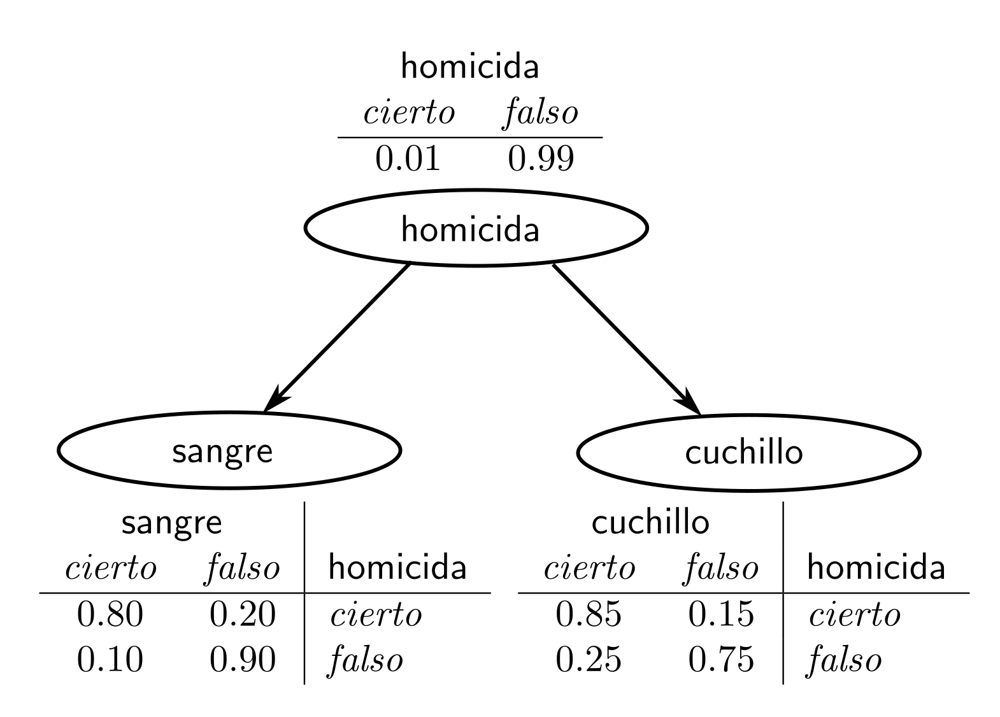
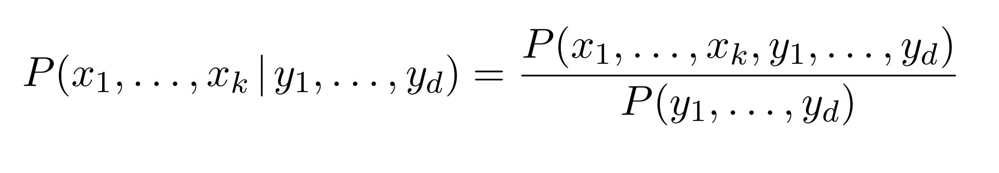
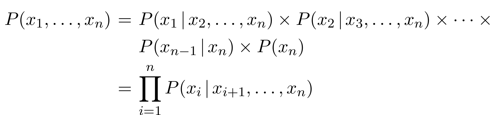
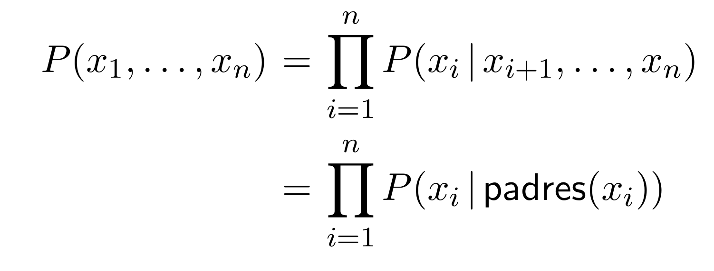

# Verificación de Modelos
## :rocket: Proyecto: Verificador de Modelos Probabilistico para LTL (PLTL)
**Maestría en Ciencia e Ingeniería de la Computación, UNAM**   
*Javier Enríquez Mendoza*   
*Manuel Soto Romero*   

---

### :large_orange_diamond: Antecedentes

#### Redes Bayesianas

Una **Red Bayesiana** (*Bayesian Network*) es un modelo pobabilístico que representa un conjunto de variables aleatorias y sus dependiencias condicionales a través de una gráfica acíclica dirigida. Por ejemplo se puede usar para representar las relaciones pobabilísticas entre enfermedades y síntomas. Datos los síntomas, la red puede ser usada para computar la probailidad de la presencia de varias enfermedades[1].

Otro ejemplo que usamos con frecuencia en el desarrollo de este proyecto es el siguiente:

con este tipo de modelos podemos responder preguntas usando probabilidad condicional.

#### Verificador de Modelos para LTL 

La **Verificación de Modelos** es un método automático de verificación de sistemas formales, derivados del hardware o del software de un determinado sistema. Dicho sistema es descrito mediante un modelo, que debe satisfacer una especificación formal descrita mediante una fórmula, a menudo escrita en alguna variedad de lógica temporal[2].

Con lógica temporal nos referimos a una lógica decidible que nos permita razonar sobre el comportamiento del programa a través de infinitas líneas de tiempo. En este sentido, usamos como lógica LTL que contiene únicamente operadores temporales y no puede distinguir diferentes ejecuciones de programas[3]. 

#### El Proyecto

El proyecto consiste en implementar un verificador de modelos probabilístico para LTL que sea capaz de interpretar fórmula probabilisticas que pueden ser de tres tipos: (1) fórmulas atómicas, (2) fórmulas condicionales y (3) fórmulas *múltiples*.

Para la implementación usamos el lenguaje de programación **Haskell**.

---

### :large_orange_diamond: Implementando Redes Bayesianas

Para implementar redes bayesianas nos basamos en la implementación dada en [4], misma que puede ser consultada en el siguiente [**`archivo`**](src/red_bayesiana.pl), sin embargo, dada la esencia de la Programación Lógica presente en el programa, se tuvieron que analizar distintos casos a fin de no hacer sólo una trauducción a **Haskell** y entenderlos. Algunos conceptos relevantes que se aplicaron en el programa fueron:

1. **Teorema de Bayes**

    

1. **Regla de la Cadena**

   

1. **Regla de la Cadena + Independencia Condicional**

   

La implementación final puede consultarse en el siguiente [**`archivo`**](src/bbn.hs). Para usar la biblioteca basta con importarla normalmente. Un ejemplo de esto se encuentra en el siguiente [**`archivo`**](src/test.hs).

---

### :large_orange_diamond: Implementación de Verificador para LTL

El verificador LTL fue implementado con anterioridad y está basado en las reglas de inferencia de [Bhat, Cleveland y Grumberg, 1995] que incluye además un detector de ciclos (ingenuo). Dicha implementación se encuentra en el siguiente [**`archivo`**](#).

Se realizaron las siguientes modificaciones para volver este verificador probabilístico:

1. Se eliminaron los constructores de variables atómicas y en su lugar de añadió un constructor probabilístico (`P`) que _booleaniza_ la probabilidad en el sentido de que toma un valor esperado e indica si la probabilidad calculada es mayor o igual a dicho valor.

2. Se agregaron expresiones probabilísticas que modelan los tres tipos de variables descritas en los antecedentes.

3. Sobre el modelo de Kripke:

   - Cada estado es representado por una red bayesiana
   - Se sustituyó la función de etiquetamiento por un intérprete probabilístico de la red

La implementación final puede consultarse en el siguiente [**`archivo`**](src/bbn.hs). Para usar la biblioteca basta con importarla normalmente. Un ejemplo de esto se encuentra en el siguiente [**`archivo`**](src/test.hs).

---

### :large_orange_diamond: Conclusiones

- Se puede dar una implementación puramente funcional de redes bayesianas a partir de su definición matemática y en la composición de funciones.

- Usar redes bayesianas es un buen mecanísmo de evaluación para expresiones probabilísticas condicionales.

- El agregar expresiones probabilísticas aumenta la expresividad de nuestro sistema lógico.

---

### :large_orange_diamond: Trabajo a Futuro

#### Inmediato

- Mejorar la evaluación en las redes bayesianas pues se detectó que el cálculo de las probabilidades tiene un margen de error muy pequeño.

- Aumentar la expresividad del constructor probabilístico para LTL mediante desigualdades pues en este momento sólo está definido por medio de mayor o igual.

- Refactorización del código para mejorar la eficiencia, sobre todo en la búsqueda de los padres.

#### Lejano

Generalizar la implementación usando redes bayesianas dinámicas en dónde cada estado seguría siendo una red bayesiana simple y la función de transición de nuestro modelo de Kripke nos indique la relación entre las variables de cada estado.

---

### :large_orange_diamond: Referencias

[1] Bayesian network. (2021, June 22). In Wikipedia. https://en.wikipedia.org/wiki/Bayesian_network

[2] Model checking. (2021, June 21). In Wikipedia. https://en.wikipedia.org/wiki/Model_checking

[3] Wahl, T. (2009, February 18). Temporal Logic Model Checking [Slides]. Http://Www.Cs.Ox.Ac.Uk/. http://www.cs.ox.ac.uk/people/thomas.wahl/Teaching/Software-Verification/Class-02-18/tl-mc.pdf

[4] Bratko, I. (2001). Prolog programming for artificial intelligence (3rd ed.). Pearson Education.

[4] Rosenblueth, D. (2021, May). Redes bayesianas [Slides].